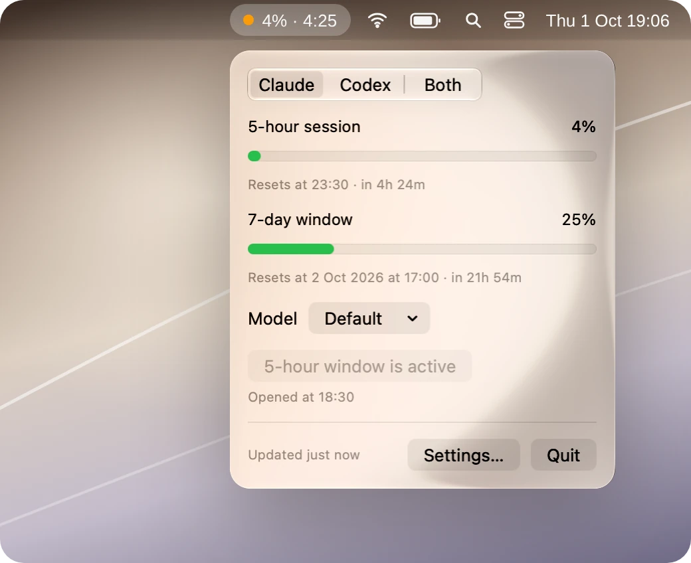
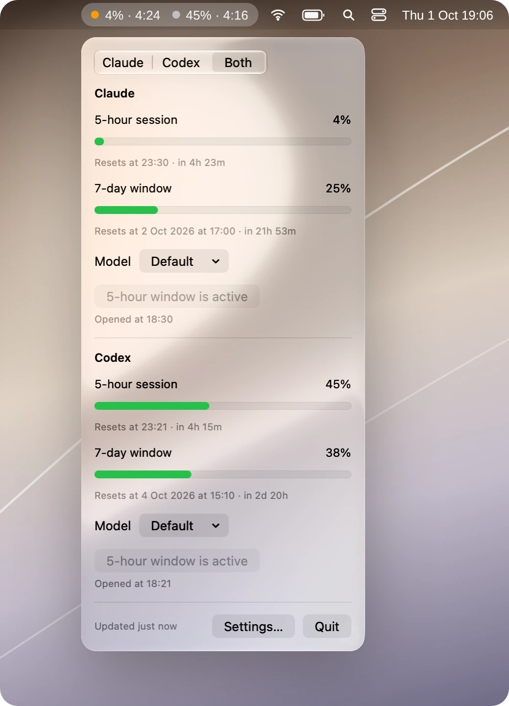

# Leeway

How much of your Claude Code and Codex limits you've used — right in the menu bar.

<p align="center">
  
  &nbsp;
  
</p>

The menu bar shows something like this:

```
63% · 2:14
```

63% of your 5-hour window is used, and it resets in 2 hours 14 minutes. Click it to see
the rest: the 7-day window, when each one resets, and which model your next session will
start on.

Leeway follows Claude, Codex, or both at once. In the menu bar, a dot in front of each number
tells you whose it is — orange for Claude, grey for Codex.

## What you can do

- **Watch your limits** — the 5-hour session and the 7-day window, for Claude Code and Codex.
- **Start a 5-hour window when it suits you.** The window starts with your first request, so
  if you start it at 9:00, it resets at 14:00 instead of in the middle of your afternoon.
- **Pick the model and effort for your next session** without opening a terminal.
- **Make the menu bar yours** — show the 5-hour or the 7-day window, percent used or percent
  left, with or without the time until reset.

## What you need

- macOS 15 or later.
- **For Claude:** Claude Code, signed in with a Claude subscription.
- **For Codex:** the Codex CLI, signed in with your ChatGPT account (`codex login`).

With an API key, neither tool reports subscription limits, so Leeway has nothing to show.

## Where the numbers come from

Leeway reads only what Claude Code and Codex already tell you. It doesn't scrape websites,
and it never reads your passwords or tokens itself — the two tools sign in on their own.

**Claude.** Every 30 seconds to five minutes, Leeway runs Claude Code's own `/usage` report.
It costs nothing and needs no setup.

For live numbers, you can also install the status line hook in **Settings → Claude Code →
Status line**. Claude Code then hands Leeway fresh numbers with every reply, along with the
model that's answering. Your existing status line keeps working: Leeway takes a copy of the
data and passes it on. Before the first change, Leeway saves a copy of your settings as
`~/.claude/settings.json.leeway-backup`, and removing the hook puts your old status line back.

**Codex.** Leeway asks the Codex CLI on your Mac for your limits
([`account/rateLimits/read`](https://developers.openai.com/codex/app-server)). This doesn't
start a conversation or spend anything.

## Starting a 5-hour window

Neither Claude nor Codex runs the 5-hour window on a fixed clock: it starts with your first
request after the last reset. **Start 5-hour window** sends that first request for you.

- **Claude:** a tiny request to Haiku. It costs next to nothing.
- **Codex:** there is no free way to do this, so the button spends a couple of thousand tokens
  of the window it opens. The request ignores your `config.toml` (your model, effort, MCP
  servers and hooks are for your work, not for this) and stays out of your session history.

## Model and effort

The **Model** menu sets what your *next* session starts with — the same thing `/model` and
`/effort` change. A session that's already running keeps its model.

Each model in the menu opens a list of effort levels, so you pick both in one click.
**Default** removes your choice and lets the tool decide. Max effort isn't offered: it only
ever lasts one session.

- **Claude:** Leeway writes the `model` key in `~/.claude/settings.json` and the effort level
  under `modelSettings`, where `/effort` keeps it too. Models are saved by family name, so
  `opus` always means the newest Opus.
- **Codex:** Leeway asks the Codex CLI to make the change, so `config.toml` keeps your
  comments and formatting.

If your shell profile sets `ANTHROPIC_MODEL` or `CLAUDE_CODE_EFFORT_LEVEL`, that wins over any
setting, and the panel tells you so. Leeway reads your shell profile at launch, so restart it
after you change the profile.

## Good to know

- `—` means there's no fresh number yet — for example, right after a window resets.
- Running several sessions at once is fine: they all share one limit.
- If a refresh fails, the last number stays on screen with its age and the error.
- Codex limits for individual models aren't shown, only the account's 5-hour and 7-day windows.

## Building from source

Xcode 26. The version comes from the git tag and the build number from the commit count, so
build from a checkout that has its tags. SwiftLint runs as the first build phase.

To test reading Codex limits, the model menu and the process handling — without signing in
or touching the network:

```sh
swiftc -module-cache-path /tmp/leeway-swift-cache \
  Leeway/Support/{ChildProcess,LoginShell,MenuBarFormat,ModelMenu,UsageSnapshot,CodexCommand,CodexAppServer,CodexUsageCommand,CodexModelCommand}.swift \
  scripts/CodexUsageChecks.swift -o /tmp/leeway-codex-checks
/tmp/leeway-codex-checks
```

Add `--live` to test against the Codex CLI you have installed and your real account.

## License

MIT — see [LICENSE](LICENSE).

Leeway is an independent project, not affiliated with or endorsed by Anthropic or OpenAI.
Claude and Claude Code are trademarks of Anthropic; Codex is a trademark of OpenAI.
